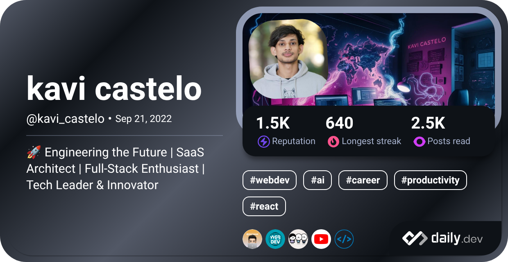

  

$$Life=\int\limits_{birth}^{death} {happiness \over time} \times \Delta time$$

‎‎ ‎ ‎ ‎ I am a **full-stack software engineer** and **entrepreneur** who specializes in developing **scalable web, mobile, and enterprise solutions**. With a strong foundation in **MEAN stack**, **Java-based systems**, and **cloud-native development**, I thrive on solving complex problems and building high-performance software.

### 🚀 About Me
- 🔥 **Co-Founder & Tech Lead** at **Talent Boozt** – Innovating **SaaS HR Tech** solutions
- 💻 **12+ hours of daily coding** – Focused on full-stack, AI, and cloud computing
- 🔬 Passionate about **AI, DevOps, and Large-Scale System Design**
- 🎯 Aiming to **achieve full financial independence** before **30** 🔥
- 🏆 **LeetCode & GitHub Streaks** – **150+ day problem-solving streak** & **600+ day contribution streak**

<i>Check out my [Digital Garden](https://kavicastelo.netlify.app/)</i>  

---
> ### ⚠️ Repository Order Notice
> I recently reorganized my repositories, which brought some older, beginner-friendly projects to the top.
These early-stage projects may lack features or contain minor bugs — but they’re a great starting point for learners or those who love to contribute!
> 
> 🔧 Contributions are warmly welcome – whether it’s fixing bugs, improving documentation, adding features, or doing code reviews.
> 
> You’ll also find more complex and production-grade projects throughout the repo list, suitable for intermediate and expert developers.
> 
> 🚀 Dive in, explore, and feel free to leave feedback, open issues, or raise pull requests. Let’s build together!
---

### 💡 Tech Stack

#### **🚀 Programming & Scripting:**

#### **🖥️ Frontend:**

#### **⚙️ Backend:**

#### **🗄️ Databases:**

#### **🌐 APIs:**

#### **☁️ DevOps & Cloud:**

#### **📊 AI & Data Science:**

---

### ⚡ GitHub Stats

  <picture>
  <source media="(prefers-color-scheme: dark)" srcset="https://github-readme-stats.vercel.app/api?username=kavicastelo&theme=radical&rank_icon=percentile&show_icons=true&show=prs_merged,reviews,prs_merged_percentage" />
  <source media="(prefers-color-scheme: light)" srcset="https://github-readme-stats.vercel.app/api?username=kavicastelo&rank_icon=percentile&show_icons=true&show=reviews,prs_merged,prs_merged_percentage" />
  
  </picture>

  

  <picture>
  <source media="(prefers-color-scheme: dark)" srcset="https://github-readme-streak-stats.herokuapp.com?user=kavicastelo&theme=radical&date_format=M%20j%5B%2C%20Y%5D" />
  <source media="(prefers-color-scheme: light)" srcset="https://github-readme-streak-stats.herokuapp.com?user=kavicastelo&date_format=M%20j%5B%2C%20Y%5D" />
  
  </picture>

  <picture>
  <source media="(prefers-color-scheme: dark)" srcset="https://github-profile-summary-cards.vercel.app/api/cards/profile-details?username=kavicastelo&theme=radical" />
  <source media="(prefers-color-scheme: light)" srcset="https://github-profile-summary-cards.vercel.app/api/cards/profile-details?username=kavicastelo" />
  
  </picture>

  <picture>
  <source media="(prefers-color-scheme: dark)" srcset="http://github-profile-summary-cards.vercel.app/api/cards/repos-per-language?username=kavicastelo&theme=radical" />
  <source media="(prefers-color-scheme: light)" srcset="http://github-profile-summary-cards.vercel.app/api/cards/repos-per-language?username=kavicastelo" />
  
  </picture>

  <picture>
  <source media="(prefers-color-scheme: dark)" srcset="http://github-profile-summary-cards.vercel.app/api/cards/productive-time?username=kavicastelo&theme=radical&utcOffset=8" />
  <source media="(prefers-color-scheme: light)" srcset="http://github-profile-summary-cards.vercel.app/api/cards/productive-time?username=kavicastelo&utcOffset=8" />
  
  </picture>

---

### 🔥 What I'm Working On
- 🚀 Scaling **Talent Boozt** for enterprise clients
- 🤖 Developing **AI-powered ATS recruitment tools**
- ☁️ Enhancing **cloud-native deployment pipelines**

---

### 🌟 Highlighted Areas of Expertise
✔ **SaaS Product Development** – Built & scaled job board platforms, HRM systems, ATS tools, and resume builders.

✔ **Enterprise Applications** – POS systems, HRM platforms, and job recruitment solutions.

✔ **AI & Machine Learning** – Experience with AI model training, data analysis, and large-scale prediction platforms.

✔ **DevOps & Cloud** – AWS, Linux, CI/CD pipelines, Docker (though not a fan 😆).

✔ **Game Development** – 2D games using JavaScript Canvas & Godot.

---

### ⚙️ My DevOps Workflow
- ✅ **Continuous Integration**: Automated builds using **GitHub Actions**
- 🚀 **Continuous Deployment**: Dockerized microservices on **AWS**
- 📈 **Monitoring**: Using **Grafana** for system health

---

### 🔹 Why Connect With Me?
🚀 **I’m passionate about tech innovation, building scalable applications, and solving real-world problems.** Open to **collaborations, speaking opportunities, and mentorship.**

📫 **Let's connect:** [Linkedin](https://linkedin.com/in/kavindu-kokila-710963250)
| [Twitter](https://twitter.com/kavicastelo)
| [Portfolio](https://kavindukokila.netlify.app)

---

### 📊 Profile Insights

---

  
🦑 Github Metrics 🌌

  <table>
    <tr>
      <td>
        
        
      </td>
      <td>
        
        
      </td>
    </tr>
  </table>

---

### 👨‍💻 Find me on communities

  <a href="https://stackoverflow.com/users/20531015/kavi-castelo">
<code></code>
</a>
  <a href="https://gitlab.com/kavicastelo">
<code></code>
</a>
  <a href="https://github.com/kavicastelo">
<code></code>
</a>
  <a href="https://leetcode.com/u/kavicastelo/">
<code></code>
</a>
  <a href="https://www.geeksforgeeks.org/user/kavicastelo/">
<code></code>
</a>
  <a href="https://www.kaggle.com/kavindukokila">
<code></code>
</a>
  <a href="https://stackexchange.com/users/26963768/kavi-castelo">
<code></code>
</a>
  <a href="https://codepen.io/kavicastelo">
<code></code>
</a>
  <a href="https://app.daily.dev/kavi_castelo">
<code></code>
</a>
  <a href="https://profile.codersrank.io/user/kavicastelo">
<code></code>
</a>
  <a href="https://codeium.com/profile/kavicastelo">
<code></code>
</a>

---

### 🌌 3D Contribution metrics(latest)

<picture>
  <source media="(prefers-color-scheme: dark)" srcset="https://github.com/kavicastelo/kavicastelo/blob/main/profile-3d-contrib/profile-night-rainbow.svg" />
  <source media="(prefers-color-scheme: light)" srcset="https://github.com/kavicastelo/kavicastelo/blob/main/profile-3d-contrib/profile-south-season-animate.svg" />
  
</picture>

---

### 📃 Gists may you important

  <a href="https://gist.github.com/kavicastelo/f7c385c372d054e1d43d71a274ed15a9/">
    <picture>
    <source media="(prefers-color-scheme: dark)" srcset="https://github-readme-stats.vercel.app/api/gist?id=f7c385c372d054e1d43d71a274ed15a9&show_owner=true&theme=radical" />
    <source media="(prefers-color-scheme: light)" srcset="https://github-readme-stats.vercel.app/api/gist?id=f7c385c372d054e1d43d71a274ed15a9&show_owner=true" />
    
    </picture>
  </a>
  <a href="https://gist.github.com/kavicastelo/bd2d807c9f436b755fa81eafc6b9d1d4/">
    <picture>
    <source media="(prefers-color-scheme: dark)" srcset="https://github-readme-stats.vercel.app/api/gist?id=bd2d807c9f436b755fa81eafc6b9d1d4&show_owner=true&theme=radical" />
    <source media="(prefers-color-scheme: light)" srcset="https://github-readme-stats.vercel.app/api/gist?id=bd2d807c9f436b755fa81eafc6b9d1d4&show_owner=true" />
    
    </picture>
  </a>

---

### 🏆 Github Trophies

  <a href="https://github.com/kavicastelo">
    <picture>
    <source media="(prefers-color-scheme: dark)" srcset="https://github-trophies.vercel.app/?username=kavicastelo&theme=radical&no-frame=true" />
    <source media="(prefers-color-scheme: light)" srcset="https://github-trophies.vercel.app/?username=kavicastelo&no-frame=true" />
    
    </picture>
  </a>

### 📈 Monthly Contribution Stats

<a href="https://github.com/kavicastelo">
<picture>
  <source media="(prefers-color-scheme: dark)" srcset="https://github-readme-activity-graph.vercel.app/graph?username=kavicastelo&theme=react-dark&radius=8&area=true" />
  <source media="(prefers-color-scheme: light)" srcset="https://github-readme-activity-graph.vercel.app/graph?username=kavicastelo&radius=8&area=true" />
  
</picture>
</a>

---

  
Activities on other dev platforms😉

<h3 align="center">Leetcode</h3>

  <a href="https://leetcode.com/u/kavicastelo/">
<picture>
  <source media="(prefers-color-scheme: dark)" srcset="https://leetcard.jacoblin.cool/kavicastelo?theme=radical&font=Basic&ext=heatmap" />
  <source media="(prefers-color-scheme: light)" srcset="https://leetcard.jacoblin.cool/kavicastelo?theme=light&font=Basic&ext=heatmap" />
  
</picture>
</a>

<h3 align="center">Codeium</h3>

  
  

<h3 align="center">Coading Activity</h3>

| Coders Rank   | Wakatime    |
| :--------- | --------: |
| <a href="https://profile.codersrank.io/user/kavicastelo/"><picture><source media="(prefers-color-scheme: dark)" srcset="https://cr-skills-chart-widget.azurewebsites.net/api/api?username=kavicastelo&bg=4b505d" /><source media="(prefers-color-scheme: light)" srcset="https://cr-skills-chart-widget.azurewebsites.net/api/api?username=kavicastelo&bg=fff" /></picture></a>  | <a href="https://wakatime.com/@kavicastelo"><picture><source media="(prefers-color-scheme: dark)" srcset="https://wakatime.com/share/@kavicastelo/15cc67e9-05bd-4000-b15d-7b4092c83d16.svg" /><source media="(prefers-color-scheme: light)" srcset="https://wakatime.com/share/@kavicastelo/e10233a1-3f24-4e3c-864c-493a4e42427a.svg" /></picture></a> |

  
  

<picture>
  <source media="(prefers-color-scheme: dark)" srcset="https://github.com/kavicastelo/kavicastelo/blob/output/github-contribution-grid-snake-dark.svg" />
  <source media="(prefers-color-scheme: light)" srcset="https://github.com/kavicastelo/kavicastelo/blob/output/github-contribution-grid-snake.svg" />
  
</picture>

---

Workflow status⚙

  

🔥 **Let's build something awesome together!**

