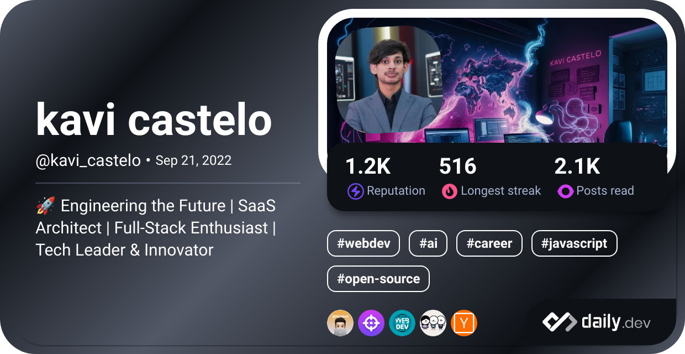

  

  
Graduated in Bachelor of Science (Hons) degree focused in Computer and Software Engineering from Cardiff Metropolitan University. Self-motivated, innovative thinking and able to work with a team. I love to work on MEAN Stack development and am also interested in the Springboot framework. I know about React, React Native, and ASP.net but am not interested in them much. Additionally, I have experience with Java mobile development and am quite interested in mobile development. Mostly I use Mongo as the database in my projects and also I know SQL, Postgres, and Firebase.

<i>Check out my [Portfolio](https://kavindukokila.netlify.app/)</i>  
<i>Check out my [Digital Garden](https://kavicastelo.netlify.app/)</i>  
<i>Check out my [Blog](https://kavicastelo.blogspot.com/)

###  

  <picture>
  <source media="(prefers-color-scheme: dark)" srcset="https://github-readme-stats.vercel.app/api?username=kavicastelo&theme=radical&rank_icon=percentile&show_icons=true&show=prs_merged,reviews,prs_merged_percentage" />
  <source media="(prefers-color-scheme: light)" srcset="https://github-readme-stats.vercel.app/api?username=kavicastelo&rank_icon=percentile&show_icons=true&show=reviews,prs_merged,prs_merged_percentage" />
  
  </picture>

  

###

<h2 align="center">Activity on Github</h2>

  <picture>
  <source media="(prefers-color-scheme: dark)" srcset="https://github-readme-streak-stats.herokuapp.com?user=kavicastelo&theme=radical&date_format=M%20j%5B%2C%20Y%5D" />
  <source media="(prefers-color-scheme: light)" srcset="https://github-readme-streak-stats.herokuapp.com?user=kavicastelo&date_format=M%20j%5B%2C%20Y%5D" />
  
  </picture>

  <picture>
  <source media="(prefers-color-scheme: dark)" srcset="https://github-profile-summary-cards.vercel.app/api/cards/profile-details?username=kavicastelo&theme=radical" />
  <source media="(prefers-color-scheme: light)" srcset="https://github-profile-summary-cards.vercel.app/api/cards/profile-details?username=kavicastelo" />
  
  </picture>

  <picture>
  <source media="(prefers-color-scheme: dark)" srcset="http://github-profile-summary-cards.vercel.app/api/cards/repos-per-language?username=kavicastelo&theme=radical" />
  <source media="(prefers-color-scheme: light)" srcset="http://github-profile-summary-cards.vercel.app/api/cards/repos-per-language?username=kavicastelo" />
  
  </picture>

  <picture>
  <source media="(prefers-color-scheme: dark)" srcset="http://github-profile-summary-cards.vercel.app/api/cards/productive-time?username=kavicastelo&theme=radical&utcOffset=8" />
  <source media="(prefers-color-scheme: light)" srcset="http://github-profile-summary-cards.vercel.app/api/cards/productive-time?username=kavicastelo&utcOffset=8" />
  
  </picture>

[//]: # (
 )

[//]: # ()

[//]: # ([![kavicastelo's github activity graph]&#40;https://activity-graph.herokuapp.com/graph?username=kavicastelo&theme=gotham&#41;]&#40;https://github.com/kavicastelo/github-readme-activity-graph&theme=github&#41;)

[//]: # ()

[//]: # (
)

 

<h3 align="center">My Current Tech Stack 👾</h3>

  <code></code>
  <code></code>
  <code></code>
  <code></code>
  <code></code>

 
 

  
🦑 Github Metrics 🌌

  
  

 

  
🧑 More about me

<h3 align="center">Languages I Know</h3>

<code></code>
<code></code>
<code></code>
<code></code>
<code></code>
<code></code>
<code></code>
<code></code>
<code></code>
<code></code>
<code></code>
<code></code>
<code></code>
<code></code>

<h3 align="center">Mostly Used Frameworks, Platforms and Libraries</h3>

  <code></code>
  <code></code>
  <code></code>
  <code></code>
  <code></code>
  <code></code>
  <code></code>
  <code></code>
  <code></code>
  <code></code>
  <code></code>
  <code></code>
  <code></code>
  <code></code>

<h3 align="center">Databases I Frequently Used</h3>

<code></code>
<code></code>
<code></code>
<code></code>
<code></code>
<code></code>
<code></code>
<code></code>

 
 

<h3 align="center">Get in touch</h3>

  
  
  
  

## 3D Contribution metrics🌌 (latest)

<picture>
  <source media="(prefers-color-scheme: dark)" srcset="https://github.com/kavicastelo/kavicastelo/blob/main/profile-3d-contrib/profile-night-rainbow.svg" />
  <source media="(prefers-color-scheme: light)" srcset="https://github.com/kavicastelo/kavicastelo/blob/main/profile-3d-contrib/profile-south-season-animate.svg" />
  
</picture>

#

  
  
  
  

## Profile Repo's Stat

## Gists may you important

  <a href="https://gist.github.com/kavicastelo/8faf5592f24a45ff1151378f0fb40309/">
    <picture>
    <source media="(prefers-color-scheme: dark)" srcset="https://github-readme-stats.vercel.app/api/gist?id=8faf5592f24a45ff1151378f0fb40309&show_owner=true&theme=radical" />
    <source media="(prefers-color-scheme: light)" srcset="https://github-readme-stats.vercel.app/api/gist?id=8faf5592f24a45ff1151378f0fb40309&show_owner=true" />
    
    </picture>
  </a>
  <a href="https://gist.github.com/kavicastelo/bd2d807c9f436b755fa81eafc6b9d1d4/">
    <picture>
    <source media="(prefers-color-scheme: dark)" srcset="https://github-readme-stats.vercel.app/api/gist?id=bd2d807c9f436b755fa81eafc6b9d1d4&show_owner=true&theme=radical" />
    <source media="(prefers-color-scheme: light)" srcset="https://github-readme-stats.vercel.app/api/gist?id=bd2d807c9f436b755fa81eafc6b9d1d4&show_owner=true" />
    
    </picture>
  </a>

 

  <a href="https://github.com/kavicastelo">
    <picture>
    <source media="(prefers-color-scheme: dark)" srcset="https://github-profile-trophy.vercel.app/?username=kavicastelo&column=9&theme=radical&no-frame=true" />
    <source media="(prefers-color-scheme: light)" srcset="https://github-profile-trophy.vercel.app/?username=kavicastelo&column=9&no-frame=true" />
    
    </picture>
  </a>

## Monthly Contribution Stats

<a href="https://github.com/kavicastelo">
<picture>
  <source media="(prefers-color-scheme: dark)" srcset="https://github-readme-activity-graph.vercel.app/graph?username=kavicastelo&theme=react-dark&radius=8&area=true" />
  <source media="(prefers-color-scheme: light)" srcset="https://github-readme-activity-graph.vercel.app/graph?username=kavicastelo&radius=8&area=true" />
  
</picture>
</a>

  
Activities on other dev platforms😉

<h3 align="center">Codeium</h3>

  
  

<h3 align="center">Daily dev</h3>

  

<h3 align="center">Coders Rank</h3>

  <a href="https://profile.codersrank.io/user/kavicastelo/">
    <picture>
    <source media="(prefers-color-scheme: dark)" srcset="https://cr-skills-chart-widget.azurewebsites.net/api/api?username=kavicastelo&bg=4b505d" />
    <source media="(prefers-color-scheme: light)" srcset="https://cr-skills-chart-widget.azurewebsites.net/api/api?username=kavicastelo&bg=fff" />
    
  </picture>
  </a>

<picture>
  <source media="(prefers-color-scheme: dark)" srcset="https://github.com/kavicastelo/kavicastelo/blob/output/github-contribution-grid-snake-dark.svg" />
  <source media="(prefers-color-scheme: light)" srcset="https://github.com/kavicastelo/kavicastelo/blob/output/github-contribution-grid-snake.svg" />
  
</picture>

---

Workflow status⚙

